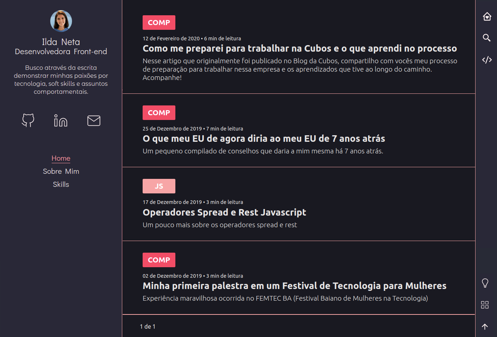
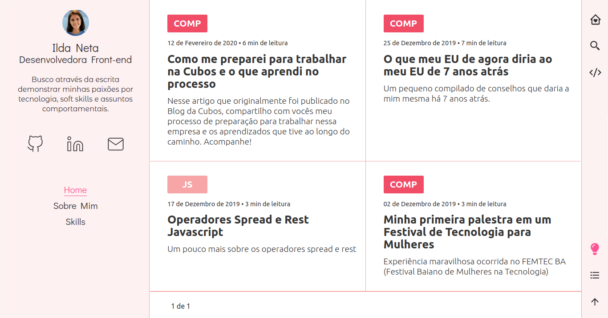

# Meu blog pessoal 🚀

1.  Para startar o projeto é necessário:

    - Entrar no repositório

    ```shell
    cd my-default-starter/
    gatsby develop

    ```

2.  O site será iniciado no `http://localhost:8000`!

    - Também será iniciado a IDE do GraphQL do gatsby no`http://localhost:8000/___graphql`

Para saber mais sobre o Gatsby acesse (https://www.gatsbyjs.org/).

## Resultado final

- O projeto possui:
  - Ligth e Dark
  - Visualização em modo Grid ou Lista

Modo Dark com visualização em lista


Modo Light com visualização em Grid


## Tecnologias utilizadas

- Disqus
- Gatsby
- GraphQL
- Algolia
- Netlify
- React Hooks
- Netlify CMS
- Styled icons
- Styled components

## Autora

- [Linkedin](https://www.linkedin.com/in/ilda-silva-neta/)
- [Blog](http://ildaneta.dev/)
